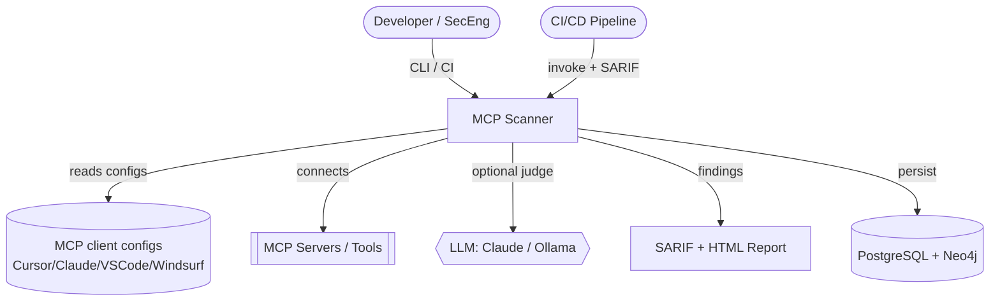
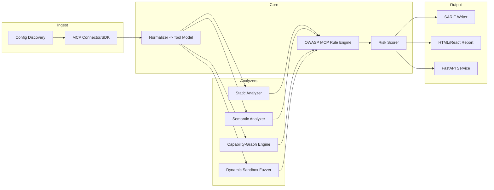

# Architecture — MCP Supply-Chain Security Scanner

## 1. Architectural Goals

- **Modular analyzers**: static, semantic, graph, and dynamic engines are pluggable.
- **Deterministic core, optional AI**: heuristics run without network; LLM judge is opt-in.
- **CI-native**: every run can emit SARIF for code-scanning gates.
- **Safe by default**: dynamic analysis is fully sandboxed and network-egress controlled.

## 2. C4 — Context Diagram

## 3. Component View

## 4. Analyzer Responsibilities

| Analyzer | Detects | Technique |
|----------|---------|-----------|
| Static | Hidden Unicode, homoglyphs, special-token injection, excessive scopes, injection phrasing | AST/schema walk, regex/unicodedata, heuristics |
| Semantic | Paraphrased tool-poisoning, jailbreak phrasing | TF-IDF/GloVe similarity to attack archetypes, optional Prompt-Guard, LLM judge |
| Capability graph | Cross-server toxic flows (read+egress chains) | Capability tagging + reachability search over graph |
| Dynamic (ATPA) | Rug-pull/time-bomb tools, runtime behavior drift | Docker sandbox, repeated invocation, egress + syscall monitoring |

## 5. Key Technology Decisions (ADR summaries)

- **Python-first core** for fast iteration; **optional Rust** module for hot-path parsing at scale.
- **NetworkX in-process** for scan-time graph ops; **Neo4j** for persisted, queryable graphs across scans.
- **LLM optional & isolated** behind an interface so runs are reproducible offline.
- **SARIF 2.1** as the primary machine format for CI/code-scanning compatibility.

## 6. Cross-Cutting Concerns

- **Determinism**: seed-free heuristics; LLM outputs cached + hashed for reproducibility.
- **Safety**: sandbox has no host mounts, `--network=none` by default, egress via a logging proxy only.
- **Extensibility**: analyzers register via entry points; rules are declarative YAML.

## 7. Quality Attributes

| Attribute | Target |
|-----------|--------|
| Static scan latency | < 2s per server (no LLM) |
| Reproducibility | Identical findings hash for identical inputs (LLM cached) |
| False positive rate | Tracked per detector in `Evaluation/` |
| Extensibility | New analyzer added without core changes |
