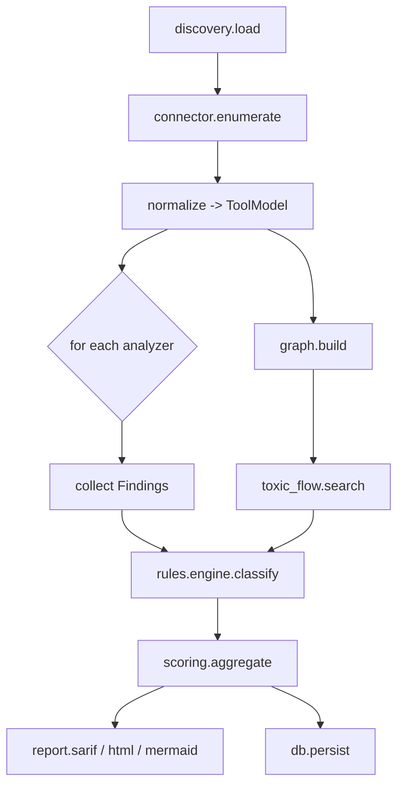

# Backend Structure — MCP Supply-Chain Security Scanner

## 1. Package Layout

```
mcpscan/
├── pyproject.toml
├── mcpscan/
│   ├── __init__.py
│   ├── cli.py                  # typer entrypoint
│   ├── config.py               # settings (pydantic-settings)
│   ├── discovery/
│   │   ├── clients.py          # Cursor/Claude/VSCode/Windsurf config locators
│   │   └── loaders.py          # parse mcp.json / settings
│   ├── connector/
│   │   ├── mcp_client.py       # MCP SDK wrapper (list tools/prompts/resources)
│   │   └── models.py           # normalized Tool/Server pydantic models
│   ├── analyzers/
│   │   ├── base.py             # Analyzer protocol + registry
│   │   ├── static_text.py      # unicode, homoglyph, special-token, injection phrasing
│   │   ├── schema.py           # excessive scopes / dangerous params
│   │   ├── semantic.py         # TF-IDF/GloVe + Prompt-Guard + LLM judge
│   │   └── dynamic.py          # Docker sandbox ATPA runner
│   ├── graph/
│   │   ├── build.py            # capability tagging + NetworkX build
│   │   ├── toxic_flow.py       # reachability search
│   │   └── neo4j_store.py      # persist + Cypher queries
│   ├── rules/
│   │   ├── catalog.yaml        # rule -> OWASP MCP Top 10 mapping
│   │   └── engine.py           # declarative rule evaluation
│   ├── scoring.py              # severity + confidence aggregation
│   ├── report/
│   │   ├── sarif.py            # SARIF 2.1 writer
│   │   ├── html.py             # single-file HTML report
│   │   └── mermaid.py          # graph export
│   ├── llm/
│   │   ├── base.py             # provider interface
│   │   ├── claude.py
│   │   ├── ollama.py
│   │   └── cache.py            # hashed response cache (reproducibility)
│   ├── api/
│   │   ├── app.py              # FastAPI app
│   │   ├── routes/
│   │   └── deps.py
│   └── db/
│       ├── models.py           # SQLAlchemy
│       └── migrations/         # alembic
└── tests/
```

## 2. Analyzer Plugin Contract

```python
class Analyzer(Protocol):
    id: str
    def analyze(self, tool: ToolModel, ctx: ScanContext) -> list[Finding]: ...
```

Analyzers register in a registry and run in a pipeline; new detectors need no core changes.

## 3. Scan Pipeline (internal)



## 4. Concurrency & Performance

- Static analyzers run concurrently per tool via `asyncio` + bounded task pool.
- LLM judge calls batched and cached; skipped when heuristic confidence is decisive.
- Optional **Rust** extension (via `pyo3`) for hot-path text scanning at large scale.

## 5. Safety Boundaries

- Dynamic analyzer spawns Docker with `--network=none`, no host mounts, dropped capabilities,
  read-only rootfs, and an egress-logging proxy when network is explicitly enabled.
- LLM prompts never execute tool output; outputs are treated as untrusted data.

## 6. Configuration

`pydantic-settings` from env + `mcpscan.toml`: LLM provider/keys, sandbox limits, rule
overrides, severity thresholds, DB DSNs.
