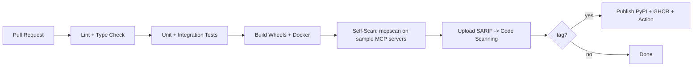

# CI/CD — MCP Supply-Chain Security Scanner

## 1. Pipeline Overview



## 2. GitHub Actions Workflows

| Workflow | Trigger | Steps |
|----------|---------|-------|
| `ci.yml` | PR/push | ruff, mypy, pytest, coverage gate |
| `build.yml` | PR/push | build wheel + sdist, build Docker (buildx) |
| `selfscan.yml` | PR/push | run scanner against fixtures, upload SARIF |
| `release.yml` | tag `v*` | publish to PyPI, push image to GHCR, publish composite Action |
| `nightly-study.yml` | schedule | re-scan public MCP corpus, diff for drift |

## 3. The Scanner as a GitHub Action (dogfooding)

```yaml
# .github/workflows/mcp-security.yml (consumer usage)
name: MCP Security
on: [push, pull_request]
jobs:
  scan:
    runs-on: ubuntu-latest
    steps:
      - uses: actions/checkout@v4
      - uses: your-org/mcpscan-action@v1
        with:
          targets: '.'
          fail-on: 'high'
          format: 'sarif'
          output: 'mcpscan.sarif'
      - uses: github/codeql-action/upload-sarif@v3
        with:
          sarif_file: 'mcpscan.sarif'
```

## 4. Quality Gates

- **Coverage** >= 80% on `analyzers/`, `graph/`, `rules/`.
- **Reproducibility test**: same fixtures -> identical findings hash (LLM mocked/cached).
- **Detector regression**: labeled corpus precision/recall must not drop below baseline.
- **Supply-chain hygiene**: pinned deps, `pip-audit`, SBOM (CycloneDX) generated per release.

## 5. Detection-as-Code for Rules

New rules land as YAML in `rules/catalog.yaml` with a matching test fixture; CI validates the
OWASP MCP mapping and runs the rule against positive/negative samples before merge.

## 6. Artifacts

- Python wheel + sdist (PyPI)
- OCI images `mcpscan` + `mcpscan-sandbox` (GHCR), multi-arch
- SARIF report attached to each CI run
- CycloneDX SBOM per release
