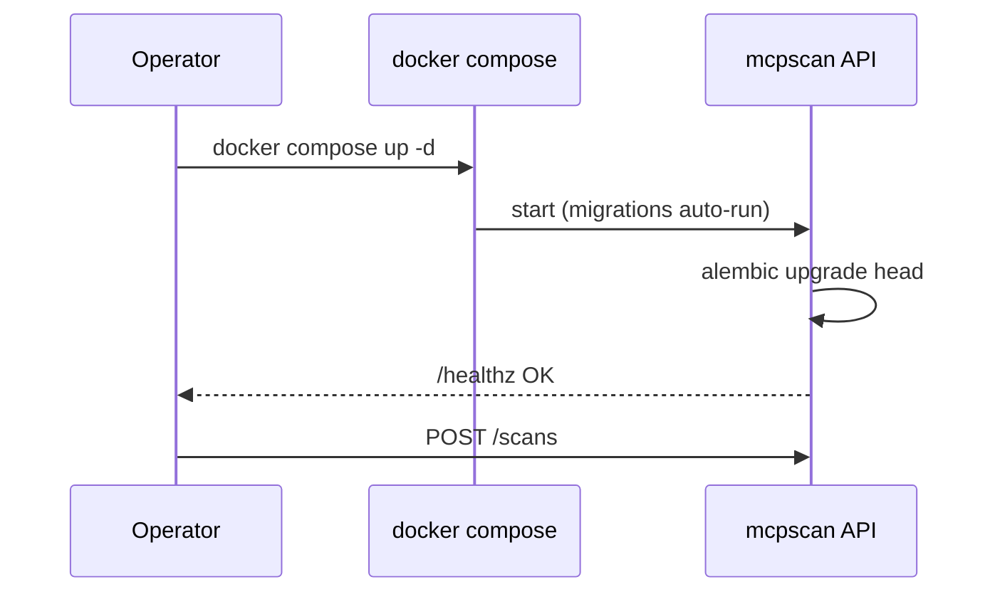

# Deployment — MCP Supply-Chain Security Scanner

## 1. Distribution Channels

```mermaid
flowchart LR
    SRC[Source Repo] --> PYPI[PyPI: pip install mcpscan]
    SRC --> GHCR[GHCR: docker pull mcpscan]
    SRC --> ACT[GitHub Marketplace Action]
    SRC --> BREW[Homebrew tap (optional)]
```

## 2. Deployment Modes

| Mode | Use case | How |
|------|----------|-----|
| **CLI (local)** | Developer scans workstation MCP configs | `pipx install mcpscan` |
| **CI Action** | Gate PRs on MCP risk | `uses: your-org/mcpscan-action@v1` |
| **Server mode** | Team dashboard + history | `docker compose up` (API + PG + Neo4j) |
| **Air-gapped** | No external LLM | local Ollama + heuristics only |

## 3. Server Mode Rollout



## 4. Configuration & Secrets

- LLM API keys via env vars / secret manager; never written to reports.
- `mcpscan.toml` for rule overrides, severity thresholds, sandbox limits.
- Offline mode disables all outbound calls (fully deterministic).

## 5. Versioning & Compatibility

- SemVer; SARIF schema version pinned per release.
- Rule catalog carries its own `catalog_version`; reports embed both scanner and catalog versions.
- Backward-compatible scan JSON so `mcpscan diff` works across versions.

## 6. Rollback

- Images tagged by version + digest; CI action pinned to major tag with digest lock.
- `pipx` allows instant downgrade; server mode rollback = redeploy previous image tag.

## 7. Release Checklist

- Tests + reproducibility + detector-regression green
- SBOM generated, `pip-audit` clean
- Changelog + rule-catalog diff documented
- PyPI + GHCR + Action published, release notes attached
