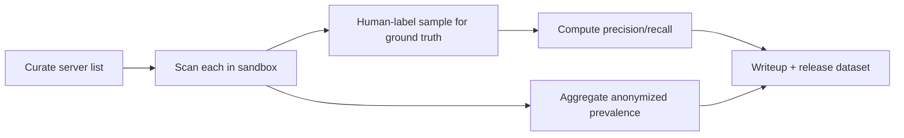

# Evaluation & Empirical Study — MCP Supply-Chain Security Scanner

> Extra section (tailored): the capstone's publishable core is an **empirical security study of
> N public MCP servers**.

## 1. Research Questions

1. What fraction of real MCP servers carry poisoning/injection risks?
2. Can a capability graph reliably surface cross-server exfiltration chains?
3. Can behavioral (ATPA) testing catch time-bomb/rug-pull tools that static analysis misses?

## 2. Datasets

| Dataset | Role |
|---------|------|
| Labeled poisoning corpus (crafted + known samples) | Precision/recall of static + semantic detectors |
| Public MCP server sample (curated list) | Prevalence study |
| Synthetic multi-server topologies | Toxic-flow recall/precision |
| Time-bomb fixtures | ATPA behavioral detection |

## 3. Metrics

- **Detection**: precision, recall, F1 per detector and per OWASP MCP id.
- **Graph**: toxic-flow recall vs. hand-labeled chains; false-chain rate.
- **Behavioral**: rug-pull detection rate; iterations-to-detect.
- **Performance**: static latency/tool; end-to-end scan time; LLM cost/cache hit rate.
- **Prevalence**: % of public servers with >=1 high finding.

## 4. Methodology

## 5. Baselines

- Single-tool description scanners (no cross-server graph).
- Heuristics-only vs. heuristics + LLM judge (ablation).
- Static-only vs. static + dynamic ATPA (ablation).

## 6. Threats to Validity

- Server list not fully representative → report sampling method.
- LLM nondeterminism → cached + temperature 0; report variance.
- Labeling subjectivity → dual-annotator agreement (Cohen's kappa).

## 7. Deliverables

- Reproducibility scripts + anonymized dataset.
- Paper draft: "An Empirical Security Study of Public MCP Servers."
- Public leaderboard-style summary in the README.
