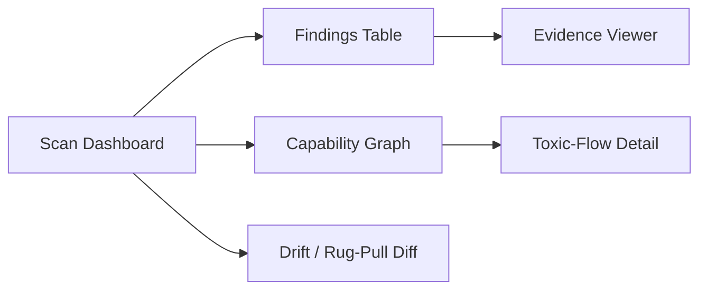
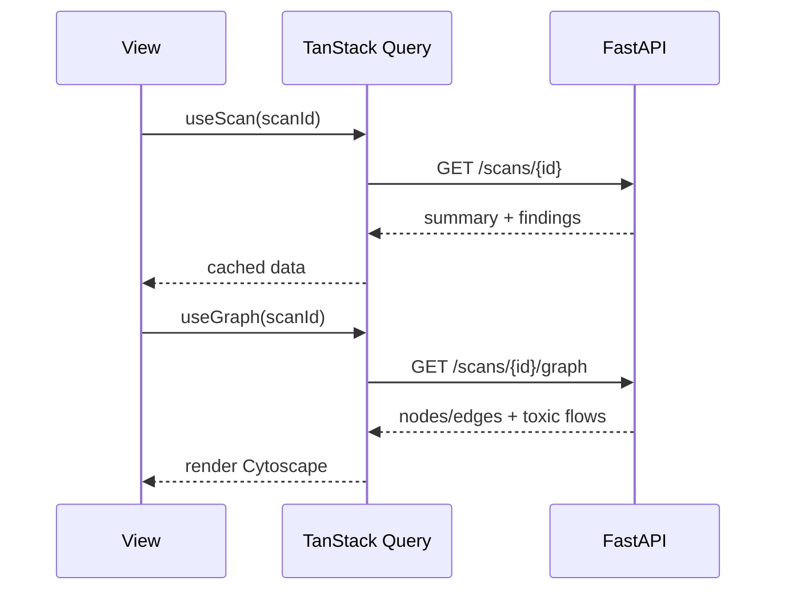

# Frontend Structure — MCP Supply-Chain Security Scanner

The frontend is a **report viewer + capability-graph explorer**. It is optional (SARIF/CLI is
primary) but makes the empirical study and demos compelling.

## 1. Stack

- **React 18 + TypeScript + Vite**
- **Tailwind CSS + shadcn/ui** components
- **Lucide** icons
- **Cytoscape.js** (or `react-flow`) for the capability graph
- **TanStack Query** for API data, **Zustand** for view state
- Static HTML export mode (single-file report) for offline sharing

## 2. Folder Hierarchy

```
frontend/
├── public/
├── src/
│   ├── main.tsx
│   ├── App.tsx
│   ├── api/                 # typed client (openapi-generated)
│   ├── components/
│   │   ├── ui/              # shadcn primitives
│   │   ├── FindingCard.tsx
│   │   ├── SeverityBadge.tsx
│   │   ├── OwaspMcpBadge.tsx
│   │   └── EvidenceViewer.tsx
│   ├── features/
│   │   ├── scan-summary/
│   │   ├── findings-table/
│   │   ├── capability-graph/   # Cytoscape wrapper + toxic-flow highlight
│   │   ├── drift-diff/         # rug-pull diff view
│   │   └── rules-catalog/
│   ├── hooks/
│   ├── lib/
│   └── styles/
├── index.html
├── tailwind.config.ts
└── vite.config.ts
```

## 3. Key Views



| View | Purpose |
|------|---------|
| Scan Dashboard | Risk score, severity counts, OWASP MCP coverage heatmap |
| Findings Table | Filter/sort by severity, server, rule, AI-assisted |
| Capability Graph | Interactive servers/tools/capabilities; toxic flows highlighted red |
| Toxic-Flow Detail | Step-by-step hop chain (source → egress) with evidence |
| Evidence Viewer | Highlighted description/schema span, hidden-Unicode reveal |
| Drift Diff | Description/schema changes across scans (time-bomb detection) |

## 4. Component Interaction



## 5. UX Principles

- **Evidence-first**: every finding shows the exact offending span.
- **Hidden-Unicode reveal**: render zero-width/homoglyph chars with visible markers.
- **Severity-driven color**: consistent palette shared with SARIF levels.
- **Offline HTML report**: fully self-contained for sharing in the empirical study writeup.
