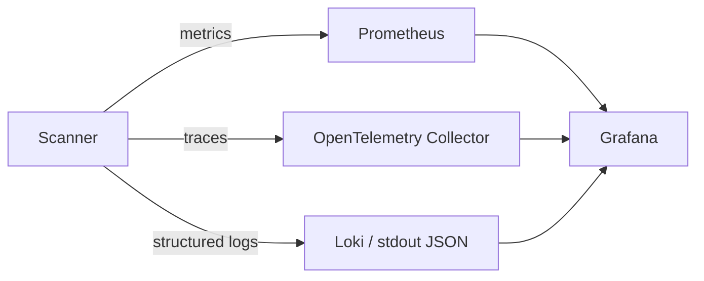

# Monitoring & Observability — MCP Supply-Chain Security Scanner

Even a CLI benefits from telemetry — especially for the empirical study and server mode.

## 1. Signals

## 2. Metrics

| Metric | Type | Purpose |
|--------|------|---------|
| `mcpscan_scan_duration_seconds` | histogram | Performance per phase |
| `mcpscan_tools_scanned_total` | counter | Throughput |
| `mcpscan_findings_total{severity,rule}` | counter | Risk trends |
| `mcpscan_toxic_flows_total` | counter | Cross-server chains found |
| `mcpscan_llm_calls_total` / `_cache_hits_total` | counter | LLM cost + cache efficacy |
| `mcpscan_sandbox_violations_total` | counter | Blocked egress/syscalls in dynamic runs |

## 3. Tracing

OpenTelemetry spans per phase: `discover`, `connect`, `static`, `semantic`, `graph`,
`toxic_flow`, `dynamic`, `report`. LLM calls are child spans with token counts.

## 4. Structured Logging

JSON logs with `scan_id`, `server`, `tool`, `rule_id`, `severity`, `ai_assisted`. Secrets and
raw tool payloads are redacted.

## 5. Dashboards (Grafana)

- **Scan Health**: duration by phase, throughput, error rate.
- **Risk Overview**: findings by severity/OWASP MCP id over time.
- **Empirical Study**: corpus-wide poisoning prevalence, toxic-flow distribution.
- **LLM Cost**: calls, tokens, cache hit rate.

## 6. Alerting (server mode)

- Scan failure rate > 5% (15m) → warn.
- New `critical` finding on a tracked server → notify.
- Sandbox violation spike → investigate (possible active malicious tool).

## 7. Empirical-Study Telemetry

The nightly corpus scan records per-server metrics into the `Evaluation/` dataset to power the
"empirical security study of N public MCP servers" writeup.
