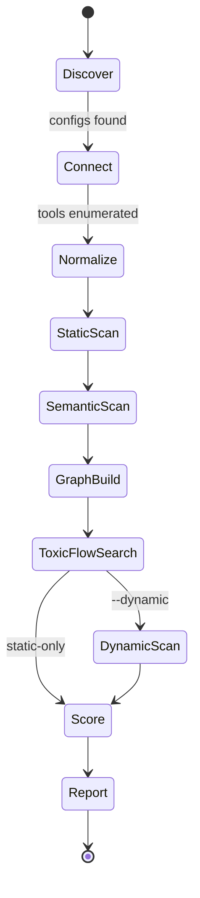
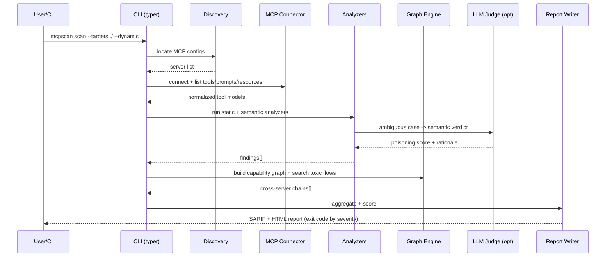
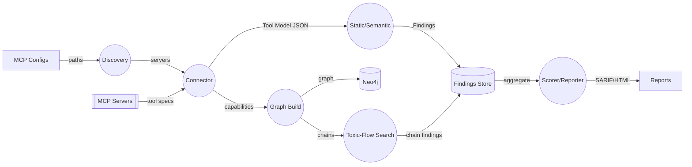
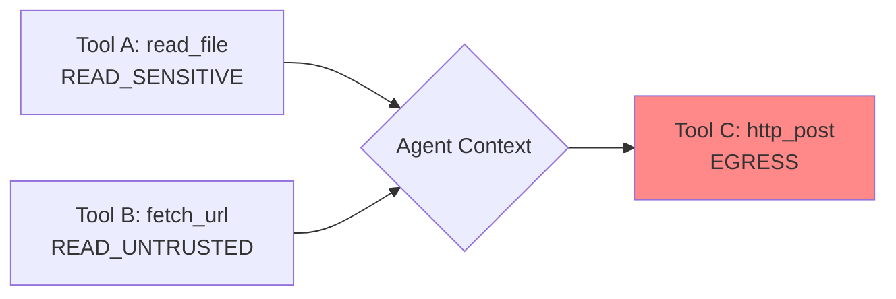

# System Design — MCP Supply-Chain Security Scanner

## 1. Scan Lifecycle (State Machine)

## 2. End-to-End Sequence

## 3. Data-Flow Diagram (DFD Level 1)

## 4. Toxic-Flow Detection Model

Each tool is tagged with **capabilities**: `READ_UNTRUSTED`, `READ_SENSITIVE`, `EGRESS`,
`WRITE_STATE`, `EXECUTE`. A **toxic flow** is any path where untrusted/sensitive data can reach
an egress capability, potentially across servers:

Detection = reachability query over the capability graph where a `READ_SENSITIVE`/`READ_UNTRUSTED`
node can influence an `EGRESS` node (same or different server), ranked by confidence.

## 5. Behavioral (ATPA) Testing

Adversarial Tool Poisoning Attack detection: invoke a tool repeatedly with benign inputs over
time/iterations and watch for description mutation, response drift, or new egress attempts —
catching **rug-pull** tools that pass static checks initially.

## 6. Non-Functional Requirements

| NFR | Requirement |
|-----|-------------|
| Safety | Dynamic runs isolated (`--network=none`, no host FS) |
| Reproducibility | Deterministic findings hash; LLM responses cached |
| Performance | 100 tools static-scanned < 30s |
| Portability | Runs as CLI, library, server, and GitHub Action |
| Auditability | Every finding carries rule id, evidence span, OWASP MCP mapping |
