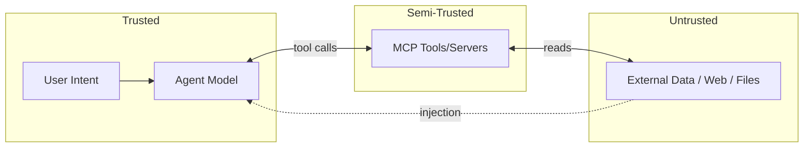

# Threat Model — MCP Supply-Chain Security Scanner

> Extra section (tailored to this project): the scanner's detections are organized around this
> threat model and the **OWASP MCP Top 10**.

## 1. Assets

- The agent's context window (trust boundary between tool output and instructions).
- User/system secrets reachable by tools (files, tokens, env, credentials).
- The host and network the agent/tools run on.

## 2. Trust Boundaries

## 3. Attack Catalog -> Detection Mapping

| Attack | Description | Detector | OWASP MCP |
|--------|-------------|----------|-----------|
| Tool poisoning | Malicious instructions in tool description/schema | static_text + semantic + LLM judge | MCP-01 |
| Prompt injection | Untrusted content overrides agent intent | semantic + flow analysis | MCP-02 |
| Hidden Unicode / homoglyph | Zero-width / lookalike chars hide payloads | static_text (unicodedata) | MCP-03 |
| Special-token injection | Chat-template tokens smuggled in text | static_text token scan | MCP-03 |
| Excessive scope | Over-broad permissions/params | schema analyzer | MCP-04 |
| Rug-pull / time-bomb | Benign tool mutates to malicious later | dynamic ATPA + drift diff | MCP-05 |
| Cross-server toxic flow | Read + egress chain across servers | capability graph | MCP-06 |
| Confused deputy | Tool abuses agent authority | graph + scope analysis | MCP-07 |
| Data exfiltration | Sensitive data reaches egress sink | toxic-flow search | MCP-06 |
| Supply-chain tampering | Unpinned/typosquatted server sources | discovery + provenance checks | MCP-08 |

## 4. Adversary Model

- **Malicious server author** publishing a poisoned tool.
- **Compromised-but-popular server** (rug-pull after adoption).
- **Ecosystem attacker** combining two benign servers into an exfil chain.

## 5. Out of Scope

- Attacks on the LLM weights themselves.
- Network MITM (assumed handled by transport security).
- Detecting *all* semantic injection (best-effort; measured in `Evaluation/`).

## 6. Residual Risk

Semantic detection is probabilistic; the scanner reports confidence and never auto-trusts. Human
review is required for `medium`-confidence semantic findings.
